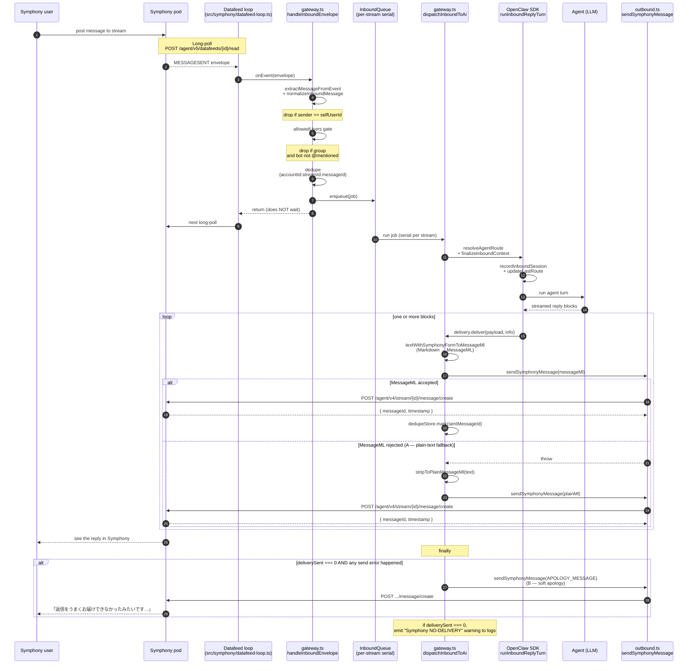
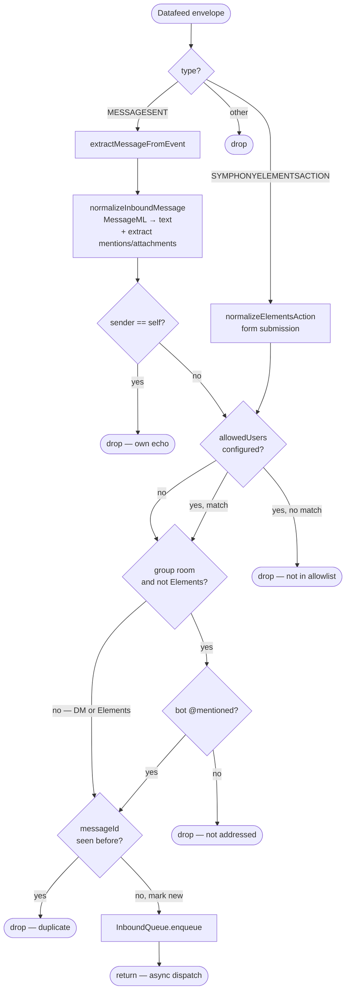
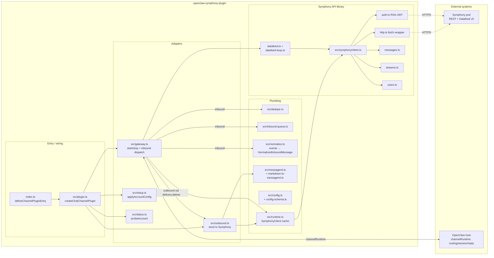
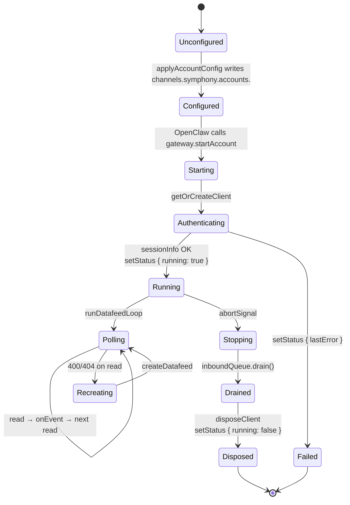
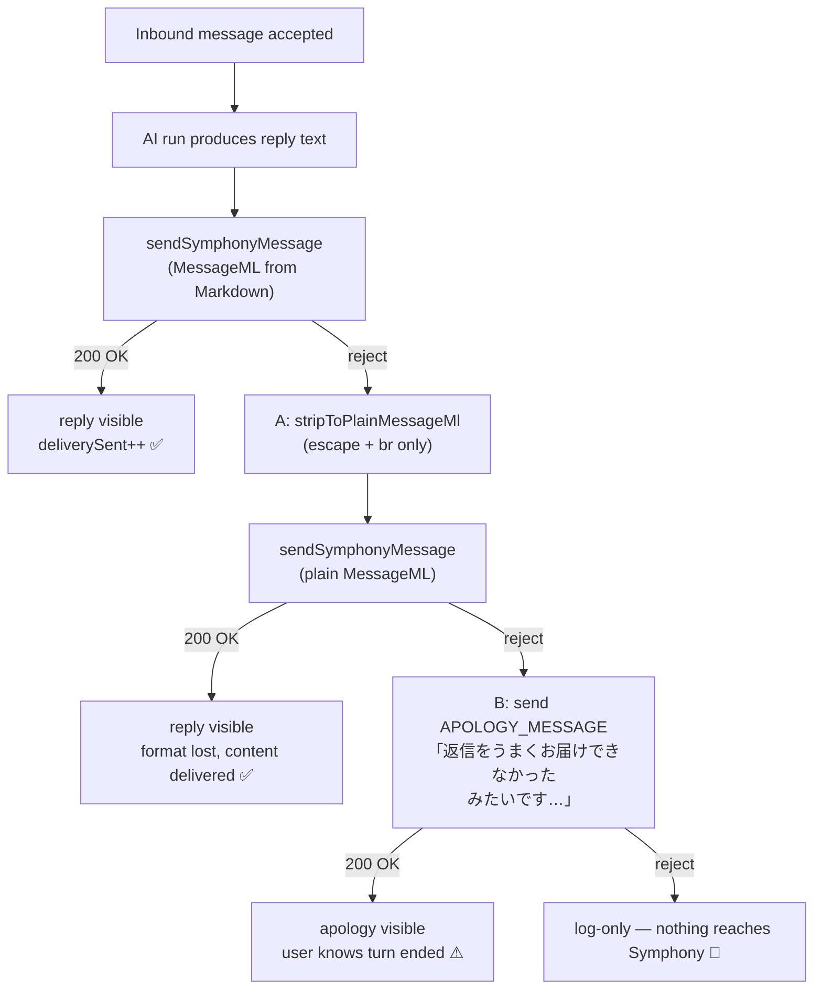

# Symphony Message Flow

End-to-end flow when a user sends a message in Symphony and gets a reply back
from the OpenClaw AI.

## 1. Sequence: a single inbound → reply turn

## 2. Inbound filter pipeline (decision tree)

## 3. Module layout

## 4. Lifecycle: account start / stop

## 5. Reply resilience (A + B)

What the Symphony user sees when something goes wrong with the reply:

| Layer | Trigger | What the user sees |
| --- | --- | --- |
| **Happy path** | MessageML accepted | Formatted reply |
| **A — plain-text fallback** | MessageML rejected (malformed XML) | Unformatted reply with the same words |
| **B — apology** | even plain-text rejected, or dispatcher dropped a payload | Fixed apology message in JP |
| **B falls through** | even the apology failed | Nothing on Symphony, logs warn `Symphony NO-DELIVERY` |

### Why there is no "C — processing indicator"

An earlier iteration added a `⏳ hourglass` emoji reaction on inbound and
removed it on completion, to give the Symphony user a visible "OpenClaw
saw this" signal while the AI was thinking. **That feature was removed**
because Symphony's *public REST API* does not expose any reaction
add/remove endpoint:

- The official FINOS [symphony-api-spec](https://github.com/finos/symphony-api-spec)
  has zero matches for `reaction` across both the pod and agent OpenAPI
  specs.
- The user-facing emoji reactions feature in the Symphony web client is
  *not* callable from bots.
- No official Symphony BDK (Java / Python / .NET) ships a reactions
  client method.

If your Symphony deployment exposes a private reactions endpoint, this
plugin does *not* use it — wire it up at the application layer if you
need it. See the comment block at the top of `src/gateway.ts` for the
historical context before re-adding any reaction code.

## Key invariants

| Invariant | Where enforced |
| --- | --- |
| Self-messages do not trigger a reply | `normalizeInboundMessage` `selfUserId` check + `dedupeStore.mark(sentId)` after send |
| No duplicate processing of the same `messageId` | `MessageDedupeStore.markIfNew` |
| Same conversation processes in order | `InboundQueue` (per `(accountId, streamId)` serial) |
| Group rooms require bot @mention (except form submissions) | mention gate in `handleInboundEnvelope` |
| Silent reply failures are observable | `Symphony NO-DELIVERY` warn in `dispatchInboundToAi` finally |
| Graceful shutdown does not cut replies mid-stream | `inboundQueue.drain()` in `stopAccount` |
| MessageML conversion failure does not lose the reply text | plain-text fallback in `delivery.deliver` (A) |
| If even the fallback fails, the user gets a clear "we failed" signal | apology message in `dispatchInboundToAi` finally (B) |
